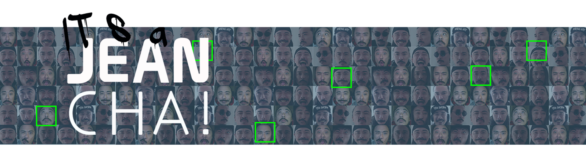
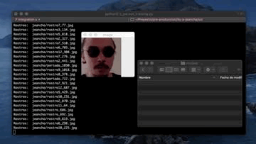
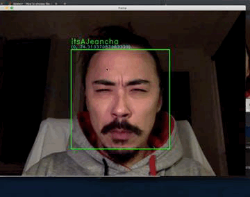
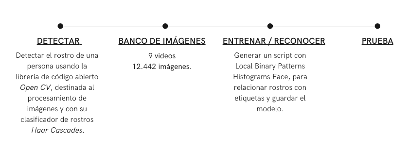

(Bootcamp Data Analytics [ironhack](https://www.ironhack.com/es))

# Introducion:

"it's a JeanCha" es un proyecto movitavado por la curiosidad sobre como el aprendizage computacional es capaz de adquirir y procesar sentidos propios de los seres humanos. 

# Objetivo: 

Crear una heramineta que permita reconocer y detectar mi imagen o la de cualquier persona.

# Proceso:

### 1. Deteccion de rostro 
Para la deteccionde y clasificacion de objetos usaremos haar-cascade presente en OpenCV. Con el modulo detectMultiScale obtendremos el famoso rectangulo de deteccion. 

No lo dudes y pasate por mi notebook[Deteccion_caras](https://github.com/yamadajc/its-a-jeancha/blob/main/notebook/Deteccion_caras.ipynb) para ver una configuracion basica de detectMultiScale.

### 2 . Almacenamiento
Como mi objetivo es el de enseñar a mi modelo quien soy,pero en el notebook [new_scan](https://github.com/yamadajc/its-a-jeancha/blob/main/notebook/new_scan.ipynb) puedes hacer el registro de tas personas desees. Realice un total de 9 video y luego obtuve un total de 14.442 imgenes. Datos mas que suficientes para reconocerme. 

Ten en cuenta que las condiciones externas en el momento que se recopilen las imagenes influiran en el reconocimineto por lo que deberias intentar variar las posturas y condiciones luminicas. 

### 3. Reconocimineto 

##### (proceso de entrenamiento)

Una vez tengamos nuestras imagenes hacemos generamos un script con nuestros datos ordenados para hasi generar un modelo con las carcteristicas de nuestro rostro. Debido a los cambios de ilumiacion producidos en el momento de la toma de las imaenes utilizare Local Binary Patterns Histograms. Este metodo describe las caracteristicas locales del objeto a analizar. 

Lo siguiente sera guardar el modelo en un .xml o .yml

Accede al notebook [entrenamiento_personas](https://github.com/yamadajc/its-a-jeancha/blob/main/notebook/entrenamiento_personas.ipynb) para entrenarlo.

## Resumen 

